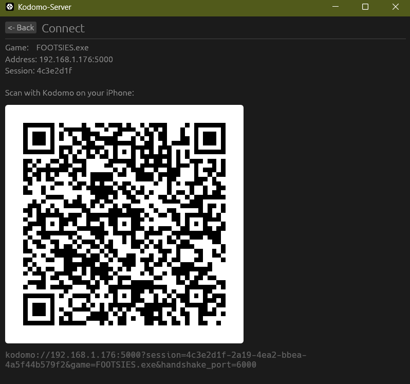

# Kodomo

Stream PC games to your phone over LAN.



## Architecture

```
kd-server   - Windows capture, encode, and stream server (Rust + egui)
kd-shared   - RTP packetization, depacketization, session types (Rust)
kd-ffi      - C exports of kd-shared for iOS (Rust)
clients/ios - iOS receiver, VideoToolbox decode, Metal render (Swift)
```

## Pipeline

```
DXGI Capture -> FrameSlot -> FFmpeg/NVENC Encode -> PacketQueue -> UDP Send
```

## Requirements

Server
- Windows 11, NVIDIA GPU (NVENC) or software fallback via libx264
- LLVM installed
- vcpkg with `ffmpeg[nvcodec]:x64-windows` or manual FFmpeg install

Client
- Xcode
- iOS-compatible device (testing on iPhone 17 Pro Max)

## Build
### Server
Copy `.cargo/config.toml.example` to `.cargo/config.toml` and fill in your paths:

```toml
[env]
# Path to your vcpkg installation ? remove if using FFMPEG_DIR instead
VCPKG_ROOT = "C:\\path\\to\\vcpkg"

# Path to a manual FFmpeg install ? remove if using VCPKG_ROOT instead
FFMPEG_DIR = "C:\\path\\to\\ffmpeg"

# Path to your LLVM bin directory ? always required
LIBCLANG_PATH = "C:\\Program Files\\LLVM\\bin"
```

Then build with:

```
cargo build
```

### Client

Open Xcode for folder clients/ios.
Copy the libkd-ffi.a from target to clients/ios/kodomo.
Copy kd-ffi.h from kd-ffi/target to clients/ios/kodomo/ffi.
Install app to device using Xcode.

## Run
Run the kd-server binary. 
Select an active .exe.
Scan the QR code using the client device's camera.
Client will connect to server upon TCP handshake confirmation.
Enjoy.

## Status
- Milestone 1 (Just stream video) **COMPLETE**
- Milestone 2 (Input streaming) **IN PROGRESS**
